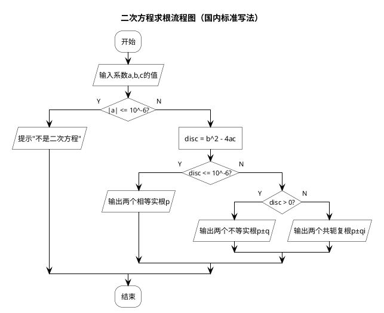
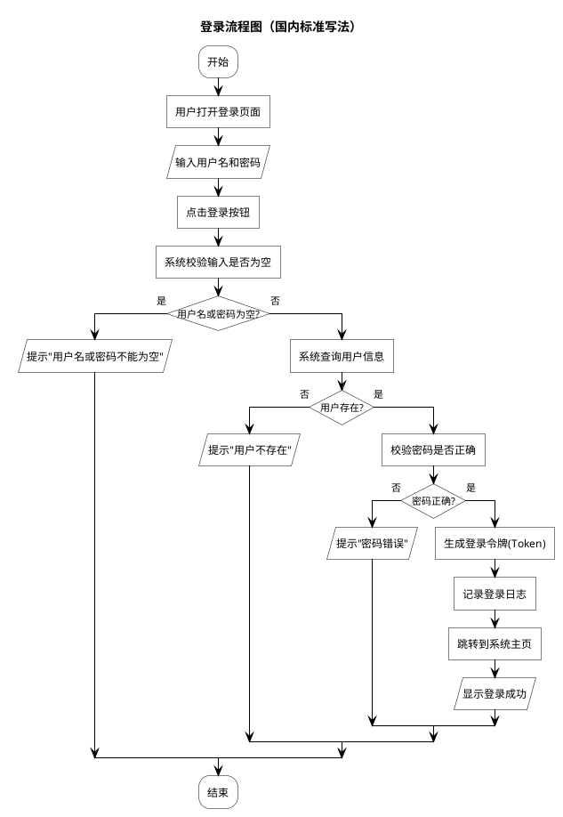
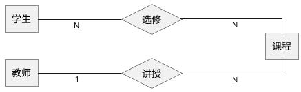
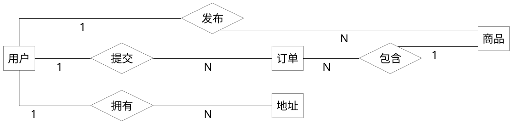
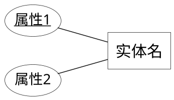

# PlantUML 语法知识库（面向 Agent 检索）

> **用途**：供自动化智能体作为结构化专业知识库检索；人类读者亦可对照查阅。  
> **权威来源**：语言关键字与预处理器集合与上游 `LanguageDescriptor` 对齐；各图类细节以 [plantuml.com](https://plantuml.com) 官方文档为准。  
> **上游参考**（关键字集合）：[PlantUML 仓库 · LanguageDescriptor.java](https://github.com/plantuml/plantuml/blob/master/src/main/java/net/sourceforge/plantuml/syntax/LanguageDescriptor.java)

---

## 0. 机器可读元数据（检索锚点）

```yaml
doc_id: plantuml-agent-kb-v1
scope: plantuml_text_syntax
encoding: UTF-8
line_endings: any
diagram_directives: # @start<name> ... @end<name>
  - "@startuml / @enduml"           # 主 UML 与多数内嵌子语言
  - "@startmindmap / @endmindmap"
  - "@startwbs / @endwbs"
  - "@startjson / @endjson"
  - "@startyaml / @endyaml"
  - "@startsalt / @endsalt"
  - "@startgantt / @endgantt"
  - "@startnwdiag / @endnwdiag"
  - "@startditaa / @endditaa"
  - "@startdot / @enddot"
  - "@startlatex / @endlatex"
  - "@startmath / @endmath"
  - "@startgit / @endgit"
  - "@startproject / @endproject"
  - "@startflow / @endflow"
  - "@startcreole / @endcreole"
  - "@startboard / @endboard"
  - "@startbpm / @endbpm"
  - "@startchart / @endchart"
  - "@startchen / @endchen"
  - "@startchronology / @endchronology"
  - "@startdef / @enddef"
  - "@startebnf / @endebnf"
  - "@startfiles / @endfiles"
  - "@starthcl / @endhcl"
  - "@startjcckit / @endjcckit"
  - "@startregex / @endregex"
  - "@startsprites / @endsprites"
  - "@startwire / @endwire"
  - "@startpacketdiag / @endpacketdiag"
retrieval_hints:
  - "先判定 @start 类型，再查对应章节"
  - "全局：skinparam、!pragma、!include、Creole、颜色名"
  - "UML 容器内可混用 activity/sequence/class 等子语法（注意版本与兼容性）"
```

---

## 1. 文档结构说明（给 Agent）

| 章节 | 内容 | 何时检索 |
|------|------|----------|
| 2 | 文件级骨架与多图 | 任意输入 |
| 3 | 预处理器 `!` | 宏、条件、包含、循环 |
| 4 | 全局：`skinparam`、`!pragma`、主题 | 统一样式、字体、颜色 |
| 5 | 元素类型关键字 `type` | 声明参与者/节点形状 |
| 6 | 通用关键字 `keyword` | 控制流、注释、布局词 |
| 7 | `@startuml` 内主要子语言 | 类图、时序、用例、活动、状态、组件等 |
| 8 | 非 UML 专用 `@start*` | JSON、甘特、网络图等 |
| 9 | Creole / 富文本 | 标签、表格、列表、加粗等 |
| 10 | 颜色与样式 | 与 `HColorSet`、skinparam 配合 |
| 11 | 常见错误与约束 | 生成后自检 |

**检索策略建议**：用户意图 → 选 `@start` 类型 → 在该类型块内查关键字表 → 用 `skinparam` 收敛视觉 → 用预处理器处理重复片段。

---

## 2. 文件级骨架

### 2.1 基本形式

每一幅图由**成对指令**闭合：

```text
@start<类型> [可选标识符]
  ... 正文 ...
@end<类型>
```

- `<类型>` 与 `@end` 后一致，例如 `@startuml` / `@enduml`。  
- **可选标识符**：`@startuml myDiagramId`，便于多文件导出时命名（CLI 行为依赖选项）。  
- 单文件可含**多段** `@start...@end...`；渲染器通常逐段输出。

### 2.2 与 Markdown / 其他语言混排

- Agent 从混合文本中提取时：优先匹配 `@start` 到最近合法 `@end` 的闭区间。  
- 若用户只写正文无包裹：部分工具会自动补 `@startuml`/`@enduml`；**生成时应显式写出包裹**，避免歧义。

---

## 3. 预处理器（`LanguageDescriptor.getPreproc()`）

以下均以行首 `!` 开头（具体是否允许前导空格依版本；**建议行首无空格**）。

| 指令 | 用途 |
|------|------|
| `!define` | 定义宏常量 |
| `!definelong` / `!enddefinelong` | 多行宏 |
| `!undef` | 取消宏 |
| `!if` / `!else` / `!ifdef` / `!ifndef` / `!endif` | 条件编译 |
| `!while` / `!endwhile` | 循环展开 |
| `!foreach` / `!endfor` | 遍历展开 |
| `!function` / `!endfunction` | 函数 |
| `!procedure` / `!endprocedure` | 过程 |
| `!return` | 从函数返回 |
| `!include` / `!import` | 包含外部文件 |
| `!includesub` / `!includedef` / `!startsub` / `!endsub` | 子文件/片段组织 |
| `!local` | 局部变量 |
| `!option` | 编译选项 |
| `!pragma` | 杂项 pragma（见第 4 节） |
| `!theme` | 主题 |
| `!assert` | 断言 |
| `!log` | 日志 |
| `!dump_memory` | 调试 |
| `!exit` | 中止处理 |
| `!final` | 最终块相关 |
| `!end` | 与部分块配对 |
| `!unquoted` | 非引用展开 |

**Agent 注意**：预处理器在**解析图之前**展开；宏内可含换行；避免与 Creole 的 `!` 冲突需理解上下文。

---

## 4. 全局外观：`skinparam`、`!pragma`、主题

### 4.1 `skinparam`

```text
skinparam <名称> <值>
skinparam <元素类型> {
  <名称> <值>
  ...
}
```

- **名称全集**随版本变化；源码中由 `SkinParam.getPossibleValues()` 维护，数量大。  
- **常用**：`backgroundColor`、`defaultFontName`、`defaultFontSize`、`monochrome`、`shadowing`、`ArrowColor`、`linetype`（如 `ortho`）、各类 `*BorderColor` / `*BackgroundColor`。

### 4.2 `!pragma`

典型用途（非穷尽）：布局引擎、Graphviz 相关、TeX 相关、版本特性开关等。以官方 `pragma` 页为准。

### 4.3 `!theme`

一键应用预设主题；可与 `skinparam` 叠加（后者常覆盖细节）。

---

## 5. 元素类型关键字（`LanguageDescriptor.getType()`）

用于声明**参与者 / 节点 / 结构**等（具体可用性依赖当前图类型与上下文）。

`abstract`, `action`, `actor`, `agent`, `analog`, `annotation`, `archimate`, `artifact`, `binary`, `boundary`, `card`, `class`, `clock`, `cloud`, `collections`, `component`, `concise`, `control`, `database`, `dataclass`, `diamond`, `entity`, `enum`, `exception`, `file`, `folder`, `frame`, `hexagon`, `interface`, `json`, `label`, `map`, `metaclass`, `network`, `node`, `nwdiag`, `object`, `package`, `participant`, `person`, `process`, `protocol`, `queue`, `record`, `rectangle`, `relationship`, `robust`, `stack`, `state`, `storage`, `struct`, `usecase`, `packetdiag`

**Agent 映射提示**：用户说「数据库」→ `database`；「微服务」→ `component`/`cloud`；「用户」→ `actor` 或 `person`；时序图里常用 `participant` / `actor` / `boundary` / `control` / `entity`。

---

## 6. 通用关键字（`LanguageDescriptor.getKeyword()` 中非 `@` 部分节选）

完整集合见源码；下表按**语义聚类**便于检索（同一词可跨图类出现）。

### 6.1 方向与布局

`top to bottom direction`, `left to right direction`, `down`, `up`, `left`, `right`, `top`, `bottom`, `across`, `order`, `together`, `rotate`, `orientation`, `page`, `newpage`, `link`, `namespace`, `package`

### 6.2 时序 / 交互控制

`activate`, `deactivate`, `create`, `destroy`, `autonumber`, `participant`, `actor`, `boundary`, `control`, `entity`, `database`, `collections`, `alt`, `opt`, `loop`, `par`, `break`, `critical`, `group`, `box`, `ref`, `mainframe`, `hnote`, `rnote`, `note`, `over`, `end`（配合 `note`/`group` 等块）

### 6.3 活动图

`start`, `stop`, `end`, `if`, `else`, `elseif`, `endif`, `while`, `endwhile`, `repeat`, `repeatwhile`, `fork`, `endfork`, `split`, `merge`, `endmerge`, `switch`, `endswitch`, `case`, `partition`, `detach`, `kill`, `goto`

### 6.4 样式与可见性

`skin`, `skinparam`, `style`, `stereotype`, `stereotypes`, `hide`, `show`, `public`, `private`, `protected`, `abstract`, `class`, `interface`, `enum`, `annotation`, `highlight`, `sprite`

### 6.5 标题与说明

`title`, `endtitle`, `caption`, `endcaption`, `header`, `endheader`, `footer`, `endfooter`, `legend`, `endlegend`, `floating note`

### 6.6 结构块杂项

`allow_mixing`, `allowmixing`, `as`, `is`, `of`, `on`, `at`, `also`, `again`, `backward`, `field`, `fields`, `method`, `methods`, `member`, `members`, `attribute`, `attributes`, `description`, `label`, `return`, `null`, `true`, `false`, `not`, `then`, `grid`, `line`, `bar`, `circle`, `circles`, `circled`, `empty`, `normal`, `plain`, `bold`, `italic`, `color`, `shape`, `spacing`, `ticks`, `h-axis`, `v-axis`, `v2-axis`, `scatter`, `area`, `address`, `footbox`, `stackMode`, `dashed`, `dotted`

**说明**：`keyword` 集合中还包含 `@start*` / `@end*` 字符串用于语法高亮与混淆；生成代码时以**真实图类型**选择对应 `@start`。

---

## 7. `@startuml` / `@enduml` 内主要子语言（UML 与混合）

下列均在 `@startuml` 块内常用；**一条源文件可描述多种视图习惯**，但 Agent 应优先保持**单意图单图**，必要时用 `newpage` 分页。

### 7.1 类图（Class）

- **声明**：`class`, `interface`, `enum`, `abstract class`, `annotation`, `struct`, `dataclass`（依版本）  
- **关系**：`<|--`, `*--`, `o--`, `-->`, `..>`, `..|>`, `--`, `..`, `{static}`, `{abstract}` 等  
- **成员**：`{field}`, `{method}`, `--` 分隔区；可见性 `+` `-` `#` `~`  
- **备注**：`note left/right/top/bottom of`, `note on link`, `legend`

### 7.2 时序图（Sequence）

- **参与者**：`participant`, `actor`, `boundary`, `control`, `entity`, `database`, `collections`, `autoactivate`（pragma/skin）  
- **消息**：`->`, `-->`, `->>`, `-->>`, `-\\`, `->x`, `o->`, `o-->` 等  
- **生命周期**：`activate`, `deactivate`, `destroy`, `create`  
- **片段**：`alt/else/end`, `opt/end`, `loop/end`, `par/end`, `critical/end`, `break/end`, `group/end`  
- **其他**：`autonumber`, `box`, `ref`, `hnote`, `rnote`, `note`

### 7.3 用例图（Use Case）

- **`actor`**, **`usecase`**, **`rectangle`** 包边界，`-->` 关联，扩展/包含用 `..>` 与 `<<extend>>` / `<<include>>` 风格 stereotype

### 7.4 活动图（Activity）

- **新版活动语法**（推荐）：`start`, `stop`, `:label;`, `if () then (yes)`, `endif`, `while`, `repeat` 等  
- **旧版**：`(*)` `-*` 等（仍可能被解析；新图优先新语法）  
- **泳道**：`|swimlane|`

#### 7.4.1 循环结构

##### while 循环
```plantuml
while (条件?)
  :循环体;
endwhile
```

##### repeat 循环（do-while 风格）
```plantuml
repeat :初始步骤;
  :循环体;
repeatwhile (条件?)
```

##### repeatwhile 完整语法（支持双箭头文本）
```plantuml
repeat :循环开始步骤;
  :循环体内容;
repeatwhile (条件?) is (条件满足时的文本) not (条件不满足时的文本)
```

**语法说明：**

| 语法格式 | 说明 | 示例 |
|---------|------|------|
| `repeatwhile (条件)` | 仅条件判断 | `repeatwhile (满足终止条件?)` |
| `repeatwhile (条件) is (文本)` | 条件满足时的箭头文本 | `repeatwhile (满足终止条件?) is (是)` |
| `repeatwhile (条件) not (文本)` | 条件不满足时的箭头文本 | `repeatwhile (满足终止条件?) not (否)` |
| `repeatwhile (条件) is (文本) not (文本)` | 双箭头都带文本 | `repeatwhile (满足终止条件?) is (是，输出结果) not (否，继续搜索)` |

**注意**：使用 `is` 和 `not` 关键字，**不是** `else`！

### 7.5 状态图（State）

- **`[*]`** 起止，`state`，`state` 嵌套，`-->` 转移，`:` 事件/守卫/动作

### 7.6 组件图 / 部署图

- **`component`**, **`interface`**, **`node`**, **`artifact`**, **`cloud`**, **`database`** 等  
- **连接**：箭头与 stereotype、`note`

### 7.7 对象图

- **`object`**, **关系** 与类图类似但强调实例

### 7.8 定时图（Timing）

- **`robust`**, **`concise`**, **`analog`**, **`binary`**, `clock`，时间轴与 `@` 标记（见官方 timing 章节）

---

## 8. 其他 `@start<类型>` 速查

| 指令对 | 典型用途 |
|--------|----------|
| `@startmindmap` | 思维导图 |
| `@startwbs` | 工作分解结构 |
| `@startgantt` | 甘特图 |
| `@startnwdiag` | 网络架构图 |
| `@startsalt` | UI 线框 / 简易界面 |
| `@startjson` / `@startyaml` | 结构化数据可视化 |
| `@startditaa` | ASCII 艺术转图 |
| `@startdot` | Graphviz DOT |
| `@startlatex` / `@startmath` | 公式 |
| `@startgit` | Git 分支可视化 |
| `@startproject` | 项目管理图 |
| `@startflow` | 流程图变体 |
| `@startebnf` | 语法 |
| `@startchen` | Chen ER |
| `@startboard` | 看板 |
| `@startbpm` | BPMN（能力随版本变化） |
| `@startchart` | 图表类 |
| `@startchronology` | 年表 |
| `@startcreole` | 纯 Creole |
| `@startdef` | 定义块 |
| `@startfiles` | 文件树 |
| `@starthcl` | HCL |
| `@startjcckit` | 图表 Jcckit |
| `@startregex` | 正则图解 |
| `@startsprites` | 精灵图定义 |
| `@startwire` | 线框/连线类 |
| `@startpacketdiag` | 分组报文时序 |

**Agent**：用户要「思维导图」不要用 `@startuml`；要「甘特」用 `@startgantt`。

---

## 9. Creole 与富文本（多图类共用）

常见于 `:` 消息文本、`note`、部分标签内：

- **加粗** `**text**`，删除线 `~~text~~`，斜体（版本差异，常用 `//` 或 Creole 约定）  
- **标题** `== title ==`, `=== sub ===`  
- **列表** `*`、`#`  
- **表格** `|` 分隔；`!</b>` 等 HTML 片段在部分上下文可用  
- **颜色** `<color:#RRGGBB>text</color>` 或与 skin 名配合  
- **链接** `[[url 文本]]`  
- **代码** 反引号包裹（上下文依赖）

具体 Creole 子集以官方 Creole 页为准。

---

## 10. 颜色与 `skinparam` 协同

- **命名颜色**：由 `HColorSet` 注册；生成时优先使用**标准色名**以降低解析失败率。  
- **十六进制**：`#RGB` / `#RRGGBB` / 带透明通道形式（依版本）。  
- **渐变与主题**：通过 `skinparam` 或 `!theme` 统一指定优于硬编码散落。

---

## 11. 生成后自检清单（Agent）

1. **成对闭合**：`@start` / `@end` 类型一致。  
2. **编码**：UTF-8；中文引号与 ASCII 箭头混用注意。  
3. **Graphviz**：类图/状态图等依赖布局引擎；若目标环境无 Graphviz，避免仅适合 DOT 的高级特性或改用 server/ELK pragma（视部署）。  
4. **版本**：新语法在旧 JAR 上可能失败；可注明最低版本或避免极新特性。  
5. **单图复杂度**：节点过多时建议拆分或使用 `package`/`together`/`page`。

---

## 12. 官方扩展阅读（人类与 Agent 补全细节）

- 语言入口：<https://plantuml.com/zh/guide>（语言选中文时）  
- 各图专页：站点左侧导航按图类打开  
- 源码索引：`net.sourceforge.plantuml` 包下按图类分目录（如 `classdiagram`、`sequencediagram`）

---

## 12. 国内高校流程图标准（GB/T 1526 规范风格）

### 12.0 国内高校模式生成模板（严格遵守！）

当用户要求用「国内高校模式」时，**必须严格按照以下 6 个步骤输出**：

#### 模板开始

```plantuml
@startuml activity
' 第1步：必须加 "activity"，否则会报错 "Cannot find if"
title 这里填流程图标题

' 第2步：这 3 行 skinparam 必须有！
skinparam ActivityShape roundedbox
skinparam ConditionStyle InsideDiamond
skinparam ConditionEndStyle HLine

' 第3步：可选的统一样式
skinparam activity {
  BorderColor black
  BackgroundColor white
  ArrowColor black
}

' 第4步：开始节点，必须是 ":开始;"，不要用 start，且不带任何标签
:开始;

' 第5步：流程图内容
' 输入/输出节点：必须加 <<save>> 标签，例如：":输入用户数据; <<save>>"
' 处理节点：必须加 <<task>> 标签，例如：":计算结果; <<task>>"
' 判断节点：if (判据?) then (是) ... else (否) ... endif
' 第6步：结束节点，必须是 ":结束;"，不要用 stop，且不带任何标签
:结束;
@enduml
```

---

### 12.1 核心说明
国内高校与工程界在绘制程序流程图时，偏好与国际 UML 标准略有差异的一套约定：
- **开始/结束**：使用**圆角矩形**（避免 UML 标准的实心圆）
- **处理**：矩形，若需圆角则统一设为圆角
- **判断/条件**：菱形，且**判据文字放在菱形内部**（非上方/分支标注）
- **输入/输出**：平行四边形
- **分支汇合**：仅显示连线，不画结束小菱形

### 12.2 必加的 skinparam 配置
任何国内标准流程图**必须包含**这三行配置：

```plantuml
skinparam ActivityShape roundedbox      // 所有活动节点（开始/结束/处理）为圆角矩形
skinparam ConditionStyle InsideDiamond  // 判断节点为菱形，且判据文字在菱形内部
skinparam ConditionEndStyle HLine       // 分支汇合只画横线，不画结束小菱形
```

### 12.3 各节点语法对照
| 功能 | 国内标准形状 | PlantUML 语法 | 说明 |
|------|-------------|---------------|------|
| 开始/结束 | 圆角矩形 | `:开始;` 或 `:结束;` | 不带任何标签 |
| 处理/操作 | 直角矩形 | `:计算结果; <<task>>` | 表示数据处理、运算、赋值 |
| 输入/输出 | 平行四边形 | `:输入数据; <<save>>` | 表示数据输入/输出操作 |
| 判断/条件分支 | 菱形 | `if (条件成立?) then (Y) :处理分支; else (N) :处理分支; endif` | 菱形内部写判据 |

### 12.3.1 国内高校节点选择规则
在国内的流程图（特指程序流程图或业务流程图，遵循 GB/T 1526-1989 或 ISO 5807 标准）中，平行四边形和矩形的使用是有明确分工的：

**图形** | **名称** | **使用场景**
--- | --- | ---
矩形 <<task>> | 处理/操作 | 表示对数据进行的运算、赋值、转换等处理。例如：计算总分、格式转换、更新数据库、调用API。
平行四边形 <<save>> | 输入/输出 | 表示与外部环境进行数据交互。例如：读取用户输入、打印报表、显示结果、从文件读数据。

**判断原则：**
- **矩形 <<task>>：** 内部逻辑改变数据的内容、结构或存储位置。只要数据"发生某种变化"（包括赋值、计算、判断分支前的准备），就用矩形。
  示例：总分 = 语文 + 数学 → 矩形。
  示例：调用 API 获取天气 → 矩形（因为调用动作本身改变程序状态，属于处理）。

- **平行四边形 <<save>>：** 数据从外部（键盘、文件、网络、传感器）进入系统，或从系统输出到外部（屏幕、打印机、文件）。数据"过路"而不改变其值、不产生新值。
  示例：请输入用户名 → 平行四边形。
  示例：显示错误信息"密码错误" → 平行四边形。
  示例：从 order.csv 读取一行记录 → 平行四边形。

**常见混淆点：**
- "读取配置文件后解析" → 读取→平行四边形；解析→矩形
- "打印预览" → 平行四边形
- "把用户输入保存到变量" → 平行四边形（输入） + 矩形（赋值）

**国内教育习惯：**
在国内的大学计算机基础、软件工程课、软考（中级/高级）的流程图题中：
- 矩形使用频率最高，代表"处理步骤"。
- 平行四边形只用于明显的外部交互。

### 12.4 国内高校绝对禁止写的东西
1. ❌ 绝对禁止写 `start`，必须写 `:开始;`
2. ❌ 绝对禁止写 `stop`，必须写 `:结束;`
3. ❌ 绝对禁止 `@startuml` 后面不加 `activity`（否则会报错 "Cannot find if"）

### 12.5 完整示例（二次方程求根）


### 12.6 完整国内高校流程图示例（登录流程）


---

## 13. 陈氏 ER 图标准（@startchen 原生语法）

> **重要**：陈氏 ER 图必须使用 `@startchen` 语法，而非 `@startuml`。PlantUML 1.2024.5+ 版本原生支持此语法。

### 13.1 核心要素

陈氏 ER 图（Chen's ER Diagram）是由 Peter Chen 博士于 1976 年提出的数据库概念建模方法，在国内高校教学中广泛使用。

| 要素类型 | 形状 | PlantUML 语法 | 说明 |
|---------|------|-------------|------|
| 实体 | 矩形 | `entity "显示名" as ALIAS { }` | 表示现实世界中的客观事物，如"学生"、"课程" |
| 关系 | 菱形 | `relationship "显示名" as ALIAS { }` | 表示实体之间的关联，如"选修"、"讲授" |

### 13.2 关系基数表示

| 基数符号 | 含义 |
|---------|------|
| `-1-` | 一对一 |
| `-N-` | 一对多 |
| `-M-` | 多对多 |

### 13.3 基本语法结构

```plantuml
@startchen [可选标题]
left to right direction  ' 可选：横向布局

entity "实体名" as 别名 { }
relationship "关系名" as 别名 { }

' 连接实体与关系（基数标注）
实体别名 -1- 关系别名
关系别名 -N- 实体别名
@endchen
```

### 13.4 样式定制

```plantuml
@startchen
skinparam defaultFontSize 30
skinparam dpi 360

<style>
chenEntity {
  BackGroundColor white
  BorderColor black
  FontSize 30
}
chenRelationship {
  BackGroundColor white
  BorderColor black
  FontSize 30
}
</style>

entity "用户" as User { }
relationship "收藏" as FavoriteRel { }
entity "商品" as Product { }

User -N- FavoriteRel
FavoriteRel -M- Product
@endchen
```

### 13.5 完整示例（学生选课系统）



### 13.6 完整示例（数据库全局 ER 图）



### 13.7 使用注意事项

1. **必须使用 @startchen**：开头必须是 `@startchen`，结尾必须是 `@endchen`
2. **实体定义格式**：`entity "显示名" as ALIAS { }`（注意顺序：显示名在前，别名在后）
3. **关系定义格式**：`relationship "显示名" as ALIAS { }`
4. **基数标注**：使用 `-1-`、`-N-`、`-M-` 连接实体与关系
5. **版本要求**：PlantUML >= 1.2024.5
6. **必须添加 ortho 线类型**（关键！）：必须添加 `skinparam linetype ortho` 确保连接线为直线
7. **花括号必须单独一行**（关键！）：
   - ❌ 错误：`relationship "拥有" as Own { }`（花括号在同一行）
   - ✅ 正确：
     ```plantuml
     relationship "拥有" as Own {
     }
     ```
8. **严禁使用 note**（关键！）：Chen ER 图语法不支持 `note` 指令，使用会导致语法错误
9. **常见错误**：
   - ❌ `entity ALIAS as "显示名" { }` - 顺序错误
   - ✅ `entity "显示名" as ALIAS { }` - 正确顺序

### 13.8 布局优化技巧

#### 13.8.1 紧凑布局配置



#### 13.8.2 常用布局参数

| 参数 | 说明 | 推荐值 |
|------|------|--------|
| `skinparam defaultFontSize` | 全局字体大小 | 18-24 |
| `skinparam dpi` | 输出分辨率 | 150-300 |
| `skinparam spacing` | 节点间距 | 40-80 |
| `skinparam nodeSpacing` | 节点间距离 | 30-60 |
| `skinparam rankSep` | 层次间距 | 40-100 |

#### 13.8.3 布局方向

- `left to right direction` - 横向布局（推荐）
- `top to bottom direction` - 纵向布局

#### 13.8.4 属性类型标记

| 标记 | 含义 | 示例 |
|------|------|------|
| `<<key>>` | 主键/唯一标识 | `学号 <<key>>` |
| `<<derived>>` | 派生属性 | `年龄 <<derived>>` |
| `<<multi>>` | 多值属性 | `电话 <<multi>>` |

### 13.9 与活动图模拟法的对比

| 维度 | @startchen（推荐） | 活动图模拟（不推荐） |
|------|-------------------|---------------------|
| 语法基础 | `@startchen` | `@startuml activity` |
| 实体形状 | 原生矩形 | 矩形（通过 <<task>>） |
| 关系形状 | 原生菱形（内有文字） | 菱形（通过 <<save>> 模拟） |
| 基数支持 | 原生 `-1-`/`-N-`/`-M-` | 需手动标注 |
| 复杂度 | 低（原生支持） | 高（需自定义扩展） |
| 兼容性 | 标准语法，兼容性好 | 需要自定义 BoxStyle |

---

## 附录 A：预处理器完整列表（源码一致）

`!assert`, `!define`, `!definelong`, `!dump_memory`, `!else`, `!end`, `!enddefinelong`, `!endfor`, `!endfunction`, `!endif`, `!endprocedure`, `!endsub`, `!endwhile`, `!exit`, `!final`, `!foreach`, `!function`, `!if`, `!ifdef`, `!ifndef`, `!import`, `!include`, `!includedef`, `!includesub`, `!local`, `!log`, `!option`, `!pragma`, `!procedure`, `!return`, `!startsub`, `!theme`, `!undef`, `!unquoted`, `!while`

---

## 附录 B：`@start` / `@end` 类型完整列表（源码一致）

对应 `addDirectivePair`：`board`, `bpm`, `chart`, `chen`, `chronology`, `creole`, `def`, `ditaa`, `dot`, `ebnf`, `files`, `flow`, `gantt`, `git`, `hcl`, `jcckit`, `json`, `latex`, `math`, `mindmap`, `nwdiag`, `project`, `regex`, `salt`, `sprites`, `uml`, `wbs`, `wire`, `yaml`, `packetdiag`

即：`@startuml`…`@enduml`、`@startjson`…`@endjson` 等。

---

*文档版本：与 PlantUML 源码 `LanguageDescriptor` 同步的指令/关键字枚举；细粒度语法以官方文档与具体 JAR 版本为准。*
