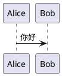
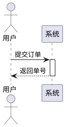
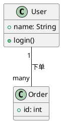
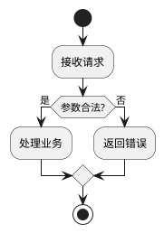
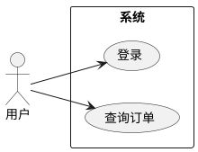
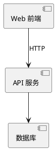
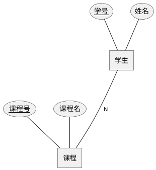
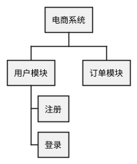

# PlantUML 语法速查（应用内）

> 面向本工作室「大纲源码框」可直接粘贴使用的常见写法。完整规范见 [plantuml.com](https://plantuml.com/zh/guide)。

## 1. 基本结构

每种图都以 `@start…` 与 `@end…` 成对包裹：

常见图种首行：

| 图种 | 首行 |
|------|------|
| 通用 UML | `@startuml` |
| 活动/流程 | `@startuml activity` |
| Chen ER | `@startchen` |
| WBS 结构 | `@startwbs` |
| 甘特 | `@startgantt` |

## 2. 时序图（Sequence）

要点：`->` 实线箭头，`-->` 虚线返回；`activate`/`deactivate` 表示生命线激活。

## 3. 类图（Class）

关系：`--` 关联，`<|--` 继承，`..>` 依赖，`*--` 组合。

## 4. 活动图 / 流程图

国内高校模式常用 `:步骤; <<task>>`（处理）、`:输入; <<save>>`（数据）、`if (条件) then`（判定）。

## 5. 用例图（Use Case）

## 6. 组件图 / 部署图

## 7. Chen ER 图

注意：Chen 图**不要**使用 `note` 指令。

## 8. WBS 工作分解

## 9. 常用排版

```plantuml
@startuml
title 我的图标题
skinparam backgroundColor #FFFFFF
skinparam defaultFontName Microsoft YaHei
@enduml
```

- `title` 单行标题（勿在 title 内写 `\n`）
- `skinparam` 控制颜色、字体、圆角等
- `left to right direction` 改变默认方向

## 10. 在本工作室中的建议

1. 先在「大纲源码框」写一版可渲染底稿，再用 Agent 自然语言「在现有基础上修改…」。
2. 渲染失败时查看状态栏或「文件 → 查看错误日志」，根据行号修正语法。
3. 复杂图拆成多个 `@startuml` 文件或在一张图中用 `package`/`partition` 分区。
4. 智能生成结果写入源码框后，可手动微调再点「渲染预览」验证。
